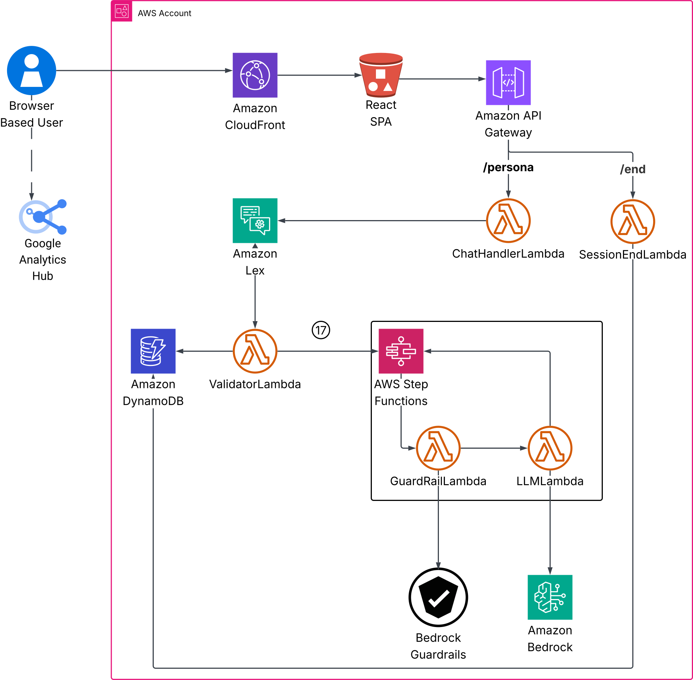

# 📝 Customer Persona Experience App — Take-Home Exercise

Welcome! This repository is for the **Customer Persona Experience App** take-home exercise.

Your goal is to build an interactive app that generates customer personas and simulates a chat experience where the user helps the persona solve a product or service challenge.

---

## 🎯 Objective

Demonstrate your skills in:
- System architecture
- UI design
- Data handling
- User interaction flows
- AI integration

---

## 🔹 Requirements

### Step 1: Company Input
- Collect the **company name** and **company characteristics** (free text or tags).

### Step 2: Persona Generation
Generate a customer persona containing:
- Name
- Age
- Gender
- Location
- Job Title
- Interests
- Challenges

### Step 3: Chat Experience
- Present a challenge from the persona related to the company's products/services.
- Allow the user to respond and assist the persona.
- Support at least 2–3 back-and-forth interactions.

---

## 🔹 Technical Constraints

- **React** app (any framework — Next.js, Remix, etc.).
- **AI-powered** persona generation and chat experience.
- Use **any AI model you want** free or paid.
- **Server-side component required** (no client-only apps).

---

## 🔍 Evaluation Criteria

- Clean, usable UI design.
- Code readability and structure.
- Effective use of AI.
- Creativity and user experience.

---

## 📦 Submission Instructions

1. Fork this repository.
2. Push code to your fork.
3. Include a `README.md` (this file) updated with any additional details you'd like to share.
4. Provide clear instructions for how to run the app locally.
5. No need to include any API keys. We will use our own for testing.

---
# Architecture Diagram



# `Front End Web UI` 

## Web URL

https://d1080c9c9lj37d.cloudfront.net/

## Persona Assistant

Persona Assistant is a modern, mobile-friendly, single-page React application that connects to an AWS Lex V2 chatbot. It helps users generate customer personas for their company, brand, or product by chatting with an AI-powered assistant.

### Features

- Chat-based persona generation using AWS Lex V2
- Centered, elegant UI with brand logo and titles
- Fully responsive: centered card on desktop, full-screen on mobile
- Bootstrap 5 styling with custom message bubbles
- Typing indicator and professional assistant icons
- Optional mock mode (no backend needed for local testing)

## Tech Stack

| Layer               | Technology                          |
|---------------------|----------------------------------   |
| Frontend            | React (no CRA or Vite)              |
| Styling             | Bootstrap 5                         |
| Bot Integration     | AWS Lex V2 via API Gateway + Lambda |
| Hosting (optional)  | AWS S3 + CloudFront                 |
| Icons               | react-icons (configurable)          |

## Project Structure


```
persona-assistant/
├── public/                # Static assets
│   └── logo.png
├── src/
|   |-- assets/
|   |   |-- logo.png
│   ├── components/
│   │   ├── ChatComponent.jsx
│   │   └── MessageBubble.jsx
│   ├── App.jsx
│   └── index.js
├── webpack.config.js
├── .babelrc
├── package.json
└── README.md
```
**Sample Rest API Payload**

 ```json
  {
    "sessionId":"sess-1747545307389",
    "text":"Hello"
  }
 ```

## Setup Instructions

1. Clone the repository

```bash
git clone https://github.com/your-username/take-home-exercise.git
cd MyPersonaGen
````

2. Install dependencies

```bash
npm install
```

3. Run in development mode

```bash
npx webpack serve
```

4. Open in browser

```
http://localhost:3000
```

## Deployment (S3 + CloudFront)

1. Build for production

```bash
npx webpack --mode production
```

2. Sync to S3

```bash
aws s3 sync dist/ s3://your-bucket-name --acl public-read
```

3. Set up CloudFront for HTTPS and CDN support

## AWS Lex Bedrock Integration (via Lambda)

This app calls Lex using the following synchronous pattern:

```
SPA → API Gateway → Lambda → Lex V2 -> Lambda (Bedrock Guardrails - Toxicity Check) -> bedrock AI
```

## Mock Mode

To test without connecting to AWS:

* Enable mock logic in `ChatComponent.jsx` by simulating responses locally.
* Useful for UI development without backend setup.

---


# `Back End AWS` 

The back end is fully configured in an AWS environment. And uses Bedrock LLM. Specifically it uses **Titan Text G1 - Premier** with Model ID **amazon.titan-text-premier-v1:0**
## Pre Cloudformation Deployment steps

**Note - Before starting stack submission**
 - please configure bedrock guardrails and note 
    - GuardrailId 
    - GuardrailVersion - This will default to 1. But may change in the future.
 - The guardrails should detect and block
    - Toxicity
    - Hate speech
    - Violence
    - Abuse
    - Insults
    - politics
    - religion
    - self-harm
 - The Guardrail should be invoked by the lambda function before sending prompts to LLM
 - if the guardrail has Prompt attacks enabled (Enable to detect and block user inputs attempting to override system instructions.), to avoid misclassifying system prompts as a prompt attack and ensure that the filters are selectively applied to user inputs, use input tagging.<br/>

 

 - Configure bedrock with the LLM model **Titan Text G1 - Premier** with Model ID **amazon.titan-text-premier-v1:0**. List of supported models can be round at [https://docs.aws.amazon.com/bedrock/latest/userguide/models-supported.html] .Note Lambds code to access the LLM varies by Model selected. This lambda code is designed to work with **amazon.titan-text-premier-v1:0**.
 - All the lambdas use NodeJs 18 with AWS SDK v3

  **Manual SSM Params for lex - Do this before stack deployment**
 - Go to AWS Services -> System Manager -> Parameter Store and create two parameters
    - /persona/lex/LexBotAlias - Add a dummy Alias ID
    - /persona/lex/LexBotID - Add a dummy Bot ID


## CloudFormation Deployment Order - Follow this order so the cross stack parameters are generated as required


1. iam-stack.yaml
2. ssm-bedrock-config.yaml
3. persona-dynamodb-stack.yaml
3. lambda-stack.yaml
4. stepfunction-stack.yaml
6. api-gateway-stack.yaml


**The below table support the use of SSM parameters vs import/export for cross stack communication**

| Feature                      | **SSM Parameters**                                       | **CloudFormation Export/Import**                  |
| ---------------------------- | -------------------------------------------------------- | ------------------------------------------------- |
| Cross-Stack Referencing      | Flexible (can reference outside of CFN)                  | Works within same region/account                |
| Loose Coupling               | Very loose — stacks don’t depend on each other’s state   | Tight coupling — dependencies at stack level    |
| Stack Updates                | Can update without dependency reordering                 | Must update dependent stacks last               |
| Access Control               | Fine-grained IAM control via `ssm:GetParameter`          | No access control — relies on CFN internal refs |
| Dev/Test/Prod Flexibility    | Easy to override with different values                   | Must re-export/import or duplicate              |
| Debugging Simplicity         | Parameters visible in SSM console                        | Harder to trace in CFN UI                       |
| Referencing from Code        | APIs, SDKs, Lambdas can read SSM directly                | Not usable outside CloudFormation               |
| Stack Independence           | Deploy/redeploy in any order                             | Strict deployment order (parent → child)        |


## Post Cloudformation deployment action (If the webapp was deployed first)
This will be moved to a CICD process in the future. Further, the API gateway URL will be read from a property file.

1. Access the REST API created by the api-gateway stack
2. go to Stages -> expand on the plus sign next to dev all the way down to persona/post
3. copy the Invoke URL
4. Access the code for MyPersonaGen web app
5. go to src -> components -> ChatComponent.jsx
6. Scroll down to line 32, replace the fetch URL with the copied Invoke URL

---

## Amazon Lex Configuration

**Configure Amazon Lex post deployment of backend cloudformation stacks. Lex doesnot yet have full cloudformation support**

1. Create a lex bot
2. Create intent GetPersonaIntent
2. Copy paste sample utterances from gitrepo/backend/sampleUtterancesGetPersonaIntent.txt
3. Add slots companyname as type AMAZON.AlphaNumeric and characteristics as type AMAZON.FreeFormInput
4. Under fulfilment click advanced options, check use a lambda function for fulfilment
5. Save the GetPersonaIntent
6. Click on the Fallback intent to open it
7. Scrolldown to Fulfillment. click advanced options, check use a lambda function for fulfilment
8. Click on Aliases. CLick on TestBotAlias 
9. Select English US as language
10. For Lambda function select validator lambda (show display as personal-validator-lambda) and the $Latest version
11. Click save.
12. Go back to intents, and click build
13. Click on TestBotAlias and note down the ID
14. Click on the bot name and note down the ID (bot id)
15. Go to AWS Services -> System Manager -> Parameter Store and modify two parameters
    * /persona/lex/LexBotAlias - Save the TestBotAlias is here
    * /persona/lex/LexBotID - Save the Bot Id here


---


## "Why Choose a Lex Chatbot Over Directly Calling Amazon Bedrock for Your AI Applications?"
You **should use Lex** when you want:

* Voice interaction
* Guided, multi-step conversation
* Intent/slot routing
* Natural fallback/error handling
* Quick integration with contact centers or support apps

### Lex Advantages

#### 1. **Dont Re invent the wheel:**

  * **Intent classification** (e.g., “Generate a persona” vs. “Cancel”)
  * **Slot filling** (e.g., `CompanyName`, `Characteristics`)
  * **Multi-turn dialogs** (e.g., asking "What are the characteristics?" if missing)

This saves you from writing custom code to parse and manage user input structure.


#### 2. **Voice and Multimodal Interfaces**

* Lex is fully integrated with:

  * **Amazon Connect** (voice bots)
  * **Alexa**
  * **Web/mobile SDKs**

If you want your bot available on voice or omnichannel platforms, Lex is plug-and-play.

#### 3. **Guardrails, Fallbacks, Re-prompts, and Error Handling**

* Lex provides built-in:

  * FallbackIntent
  * Context-aware dialogs
  * Re-prompting for required slots

You can embed these as safety layers before even reaching Bedrock.

#### 4. **Focus Bedrock on the Creativity/Reasoning Layer**

* Let Lex handle structure and user flow.
* Let **Bedrock (Titan Text G1 - Premier)** handle the open-ended language generation:

  * Persona generation
  * Summaries
  * Creative outputs

Each system does what it does best.

#### 5. **Analytics, Versioning, and Tuning**

* Lex provides:

  * Analytics (intent success rates, slot dropout)
  * Multiple bot versions
  * A/B testing

You get enterprise-grade chatbot management without building it from scratch

---

## Lambda Descriptions

**All Lambdas have been coded in NodeJs 18 with AWS SKD V3**


### **ChatHandlerLambda.js**

#### What This Lambda Function Does

This AWS Lambda function acts as a middle layer between your frontend application and an Amazon Lex V2 chatbot.

#### How It Works

* It receives HTTP POST requests containing two things:

  * A `sessionId` to keep track of the conversation.
  * A `text` string, which is what the user types into the chat.
* It then sends this text to Amazon Lex using the `RecognizeTextCommand`.
* Lex processes the input and returns a response message.
* The Lambda extracts that message and sends it back to the frontend as a JSON response.

#### CORS Support

The function includes CORS headers, allowing it to be called from web applications hosted on different domains.

#### On Success

* Returns HTTP 200 with the chatbot's reply.

#### On Error

* Logs the error and returns HTTP 500 with a generic message: `"Internal server error."`

#### Configuration

Make sure the following environment variables are set:

* `LEXBOT_ID` – The ID of your Amazon Lex V2 bot.
* `LEXBOT_ALIAS_ID` – The alias ID of your Lex bot.
* `AWS_REGION` – The AWS region (defaults to `us-east-1` if not provided explicitly in code).


### **LLMLambda.js**

#### What This Lambda Function Does

This AWS Lambda function interacts with Amazon Bedrock to generate intelligent responses using a large language model (LLM). It supports two use cases:

1. **Customer Persona Generation**
2. **Conversational AI using a custom prompt and chat history**


#### How It Works

* The function receives a JSON payload with fields like:

  * `companyName`
  * `characteristics`
  * `personaPrompt`
  * `chatHistory`
  * `userInput`
  * `generatePersona` (flag to decide the use case)

#### Mode 1: Generate Customer Persona

If `generatePersona` is `'y'`, the function:

* Constructs a system prompt that instructs the model to generate a customer persona.
* Sends company info (`companyName` and `characteristics`) as context.
* Asks the LLM to return details like name, age, gender, job title, location, interests, and challenges.

#### Mode 2: Continue a Conversation

If `generatePersona` is not `'y'`, the function:

* Uses the `personaPrompt` as the base.
* Appends past messages from `chatHistory` to maintain conversation context.
* Adds the new `userInput` to continue the dialogue.


#### Technical Details

* Uses **Amazon Bedrock Runtime SDK** (`@aws-sdk/client-bedrock-runtime`) to interact with the LLM.
* The LLM's configuration:

  * `maxTokenCount`: 300
  * `temperature`: 0.7
  * `topP`: 1
* The LLM model ID is read from the `LLM_MODEL_ID` environment variable.
* Region is taken from the `AWS_REGION` environment variable.


#### On Success

Returns `200 OK` with the model's text response in the `answer` field.

#### On Error

Currently minimal error handling—returns whatever the model outputs or `"(No output)"` if empty.


### **GuardrailLambda.js**


#### What This Lambda Function Does

This AWS Lambda function uses **Amazon Bedrock Guardrails** to check user input for potentially harmful, unsafe, or restricted content **before** sending it to an LLM or storing it.


#### How It Works

* The function receives an input payload containing:

  * `companyName`
  * `characteristics`
  * `userInput`
* It constructs a `checkText` string from the `userInput`. If that’s not provided, it combines `companyName` and `characteristics`.
* The function sends this text to **Bedrock's Guardrail service** using the `ApplyGuardrailCommand`.


#### On Success

* If the input **passes** the guardrail check, it returns HTTP `200 OK` with the original request body.

#### On Violation

* If the input is **flagged or blocked** by the guardrail (e.g., for toxicity, bias, or policy violations), the function throws an error:
  `"Input blocked by guardrail"`


#### Configuration

Set the following environment variables:

* `AWS_REGION` – The region where Bedrock is deployed.
* `GUARDRAIL_ID` – The ID of your configured guardrail.
* `GUARDRAIL_VERSION` – The version of the guardrail to use.

#### Use Case

Use this Lambda in pipelines where you want to **pre-screen user input or generated content** before processing it further—especially in AI-powered applications where safety and compliance are critical.


### **ValidatorLambda.js**

#### What This Lambda Function Does

This AWS Lambda function powers a chatbot experience using **Amazon Lex V2**, **AWS Step Functions**, and **DynamoDB**. It handles **persona generation**, **chat history tracking**, and **context-aware conversation management** using a large language model via Step Functions.


#### Main Use Cases

1. **Generate a Customer Persona** (via `GetPersonaIntent`)
2. **Continue a Chat with an Existing Persona** (via `FallbackIntent`)


#### How It Works

##### Intent: `GetPersonaIntent`

* Extracts `companyName` and `characteristics` from Lex V2 slots.
* Triggers a **Step Function** that uses a large language model to generate a **customer persona**.
* Stores the generated persona and initializes an empty chat history in **DynamoDB**.

#### Intent: `FallbackIntent`

* Retrieves existing session data from DynamoDB using `sessionId`.
* Reconstructs the chat prompt using:

  * Previously stored **persona prompt**
  * **Chat history**
  * The latest **user input**
* Calls the Step Function to get the AI-generated response.
* Updates chat history in DynamoDB with the latest turn.

#### Other Intents

* If an unsupported intent is received, returns a fallback message with intent status set to `"Failed"`.


### AWS Services Used

* **Amazon Lex V2** – Captures user input and intent.
* **AWS Step Functions (Sync)** – Orchestrates calls to an LLM.
* **Amazon DynamoDB** – Stores session data (persona and chat history).
* **Amazon Bedrock** – Invoked indirectly via Step Function to generate responses.


#### Environment Variables

| Variable                              | Purpose                                 |
| ------------------------------------- | --------------------------------------- |
| `AWS_REGION`                          | AWS region for all services             |
| `TABLENAME`                           | DynamoDB table name                     |
| `PERSONA_STEPFUNCTION_ARN`            | ARN of the Step Function                |


#### On Success

* Responds with a Lex-compatible response object, containing:

  * Chat message from the LLM
  * Updated `intentState`
  * Proper dialog closure for Lex V2


#### Perfect For

* Chatbots that **simulate sales agents**, **brand ambassadors**, or **customer advisors**
* Systems needing **session-aware, persona-driven conversations**
* Applications that combine **AI-generated responses** with **persistent memory**


---


